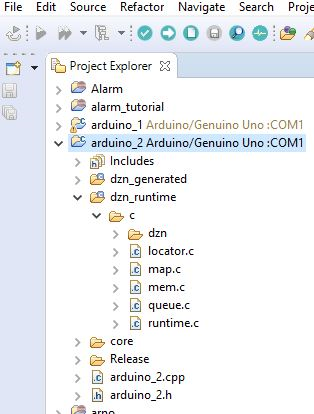
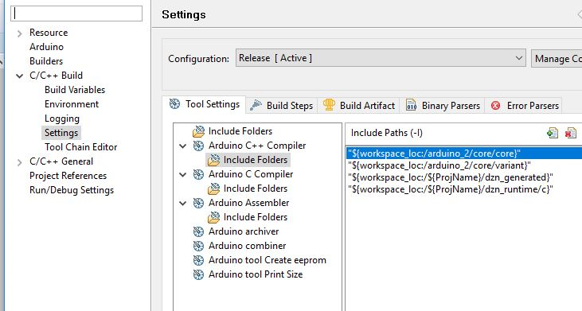
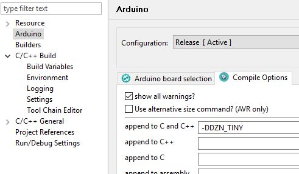
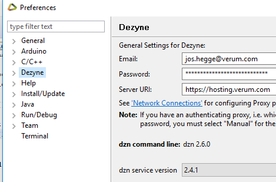

# Install the Arduino plugin

In Dezyne goto menu item 'help', 'welcome'.
On the welcome page select 'Third party tools'
Select install and follow the steps of the installer

# Create a new project

Select new, project, Arduino Sketch, next
(in the Arduino perspective this can be done in one step)
Select your board type & processor, next
Select 'Default cpp file', finish

The first time you might prefer to start from an example.

# Configure the project

If you want you can put all source files in the main directory of the project. 
However, it quickly becomes crowded so it makes sense to separate some parts in subdirectories. 
For that purpose create a local directory dzn_runtime and download the Dezyne runtime C files into it. 
Use following procedure: Select the Arduino project, click right mouse button, select ‘new’, select ‘source folder’.
Similarly create a local directory dzn_generated.
When generating code in a Dezyne project select this location to generate the source files into. 
Arduino IDE then automatically keeps track of those files and maintains the proposer build dependencies.
This is the resulting project explorer view in Eclipse:

Figure 1: project explorer view
 
These 2 directories also contain include files that must become findable by the compiler. 
Edit the project properties and add these directories.
You can do it for both the C and C++ compiler (whether you want to work in C or C++ or both if you use a mixture).
While adding them make sure you select the workspace as root of the path.

Figure 2: include directories settings

To keep the generated code as small as possible you can add an undocumented flag (Tiny-C) to the compiler settings.
You can see its usage in the runtime files.

Figure 3: add Tiny-C compile flag

# Code generation
Dezyne Code generation needs to be done in ”C” because the Dezyne C++ runtime uses STL which is not available for Arduino.
Hardware drivers (and the Serial driver, for trace output) for the Arduino will in general be coded in C++. 
A way to work around this is to:
1) Create an additional C file that does dzn run time initialization, and implements the Dezyne callback
functions.
2) In your Arduino main CPP file (that contains the setup() and loop() functions) define C++ functions that call the Dezyne C functions. 

# Closing remarks
Before you can upload to your board you must ensure to have the right USB drivers installed. 
There is ample info on the web.

See Arduino-IDE (Sloeber) documentation how to use the serial monitor etc.

Take care with using RAM and stack. You will not get any warning by compiler or loader. By default also serial output strings are stored in RAM. This can be avoided with the PROGMEM qualifier: https://www.arduino.cc/reference/en/language/variables/utilities/progmem/

NB support for C code generation has temporarily been discontinued in Dezyne because the code generators get a major refactor. Choose "dzn service version" 2.4.1 to still have access to the C code generator.

# Example
See the Dezyne & Source code files in this directory. This is a simple working example on an Arduino Robot Kit. This kit can be obtained from ebay or alibaba, e.g.
https://nl.aliexpress.com/item/Obstacle-Avoidance-Anti-drop-Smart-Car-Robot-Kit-for-Arduino-Free-Shipping/32730548433.html?spm=a2g0s.8937460.0.0.6AcbDx

